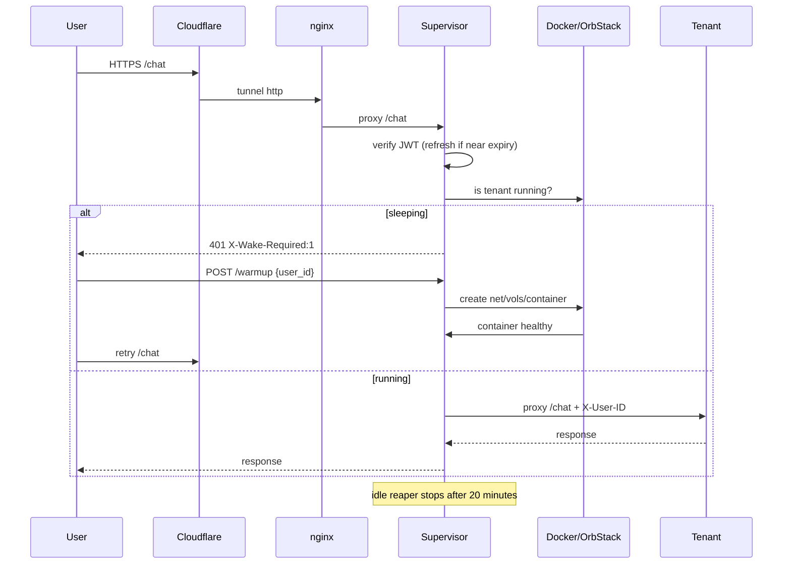

```mermaid
sequenceDiagram
  participant U as User
  participant CF as Cloudflare
  participant NG as nginx
  participant S as Supervisor
  participant D as Docker/OrbStack
  participant T as Tenant

  U->>CF: HTTPS /chat
  CF->>NG: tunnel http
  NG->>S: proxy /chat
  S->>S: verify JWT (refresh if near expiry)
  S->>D: is tenant running?
  alt sleeping
    S-->>U: 401 X-Wake-Required:1
    U->>S: POST /warmup {user_id}
    S->>D: create net/vols/container
    D->>S: container healthy
    U->>CF: retry /chat
  else running
    S->>T: proxy /chat + X-User-ID
    T-->>S: response
    S-->>U: response
  end
  Note over S: idle reaper stops after 20 minutes
```
